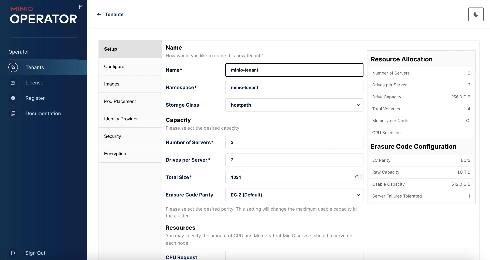

# Instalación del operador MinIO en Kubernetes

Desplegar MinIO en un clúster Kubernetes (K8s) consiste en instalar el operador MinIO y desplegar un Tenant. El operador MinIO controla el despliegue y la configuración de los Tenants de MinIO, que son instancias aisladas de almacenamiento de objetos MinIO en el clúster Kubernetes.

### 1. Instalar el operador vía Kustomize

`kubectl` desde la versión 1.14 incluye soporte para *Kustomize*.

   ```bash
   kubectl apply -k "github.com/minio/operator?ref=v5.0.15"
   ```

Este comando creará y desplegará varios recursos en el namespace `minio-operator`:

```
namespace/minio-operator created
customresourcedefinition.apiextensions.k8s.io/miniojobs.job.min.io created
customresourcedefinition.apiextensions.k8s.io/policybindings.sts.min.io created
customresourcedefinition.apiextensions.k8s.io/tenants.minio.min.io created
serviceaccount/console-sa created
serviceaccount/minio-operator created
clusterrole.rbac.authorization.k8s.io/console-sa-role created
clusterrole.rbac.authorization.k8s.io/minio-operator-role created
clusterrolebinding.rbac.authorization.k8s.io/console-sa-binding created
clusterrolebinding.rbac.authorization.k8s.io/minio-operator-binding created
configmap/console-env created
secret/console-sa-secret created
service/console created
service/operator created
service/sts created
deployment.apps/console created
deployment.apps/minio-operator created
```

Comprobar si todos los componentes están desplegados y funcionando correctamente:

```bash
kubectl get all --namespace minio-operator
```

```
NAME                                 READY   STATUS    RESTARTS   AGE
pod/console-54f4d5f597-jpt9b         1/1     Running   0          40m
pod/minio-operator-c59d74694-rd8xg   0/1     Pending   0          40m
pod/minio-operator-c59d74694-w6jwm   1/1     Running   0          40m

NAME               TYPE        CLUSTER-IP       EXTERNAL-IP   PORT(S)             AGE
service/console    ClusterIP   10.108.107.242   <none>        9090/TCP,9443/TCP   40m
service/operator   ClusterIP   10.100.64.27     <none>        4221/TCP            40m
service/sts        ClusterIP   10.100.124.184   <none>        4223/TCP            40m

NAME                             READY   UP-TO-DATE   AVAILABLE   AGE
deployment.apps/console          1/1     1            1           40m
deployment.apps/minio-operator   1/2     2            1           40m

NAME                                       DESIRED   CURRENT   READY   AGE
replicaset.apps/console-54f4d5f597         1         1         1       40m
replicaset.apps/minio-operator-c59d74694   2         2         1       40m
```

**Nota:** Si aparece un pod `minio-operator-*` en estado `Pending`, ello es debido a que el cluster Kubernetes no tiene suficientes nodos para ejecutar todos los pods (por defecto se crean con una regla de antiafinidad).

### 2. Obtener credenciales de acceso:

Este es el *token JWT* necesario para autenticarse en la interfaz web del operador:

```bash
kubectl -n minio-operator get secret console-sa-secret -o jsonpath="{.data.token}" | base64 --decode
```

### 3. Acceder al panel de MinIO y crear el Tenant:

```bash
kubectl port-forward svc/console 9090:9090 -n minio-operator
```



Más información: https://github.com/minio/operator
